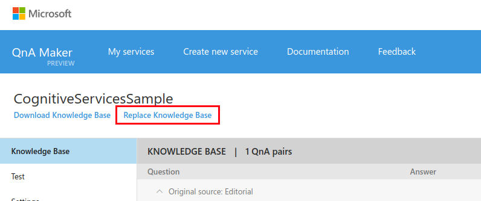
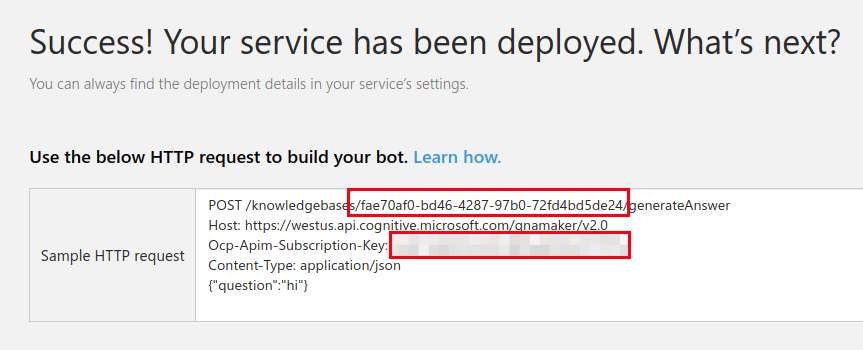

# Simple Bot with LUIS Action Binding Sample & QnA Maker Dialog

A simple bot combining LUIS Action Binding and QnA Maker Dialog, a bot that can answer common questions and also respond to user intents with pre-defined actions.

### Prerequisites

The minimum prerequisites to run this sample are:
* Latest Node.js with NPM. Download it from [here](https://nodejs.org/en/download/).
* The Bot Framework Emulator. To install the Bot Framework Emulator, download it from [here](https://emulator.botframework.com/). Please refer to [this documentation article](https://github.com/microsoft/botframework-emulator/wiki/Getting-Started) to know more about the Bot Framework Emulator.
* **[Recommended]** Visual Studio Code for IntelliSense and debugging, download it from [here](https://code.visualstudio.com/) for free.

### QnA Make Dialog
If you want to test this sample, you have to import the demo QnA Maker Knowledge base from [Smalltalk.tsv](Smalltalk.tsv) file to your [QnA Maker account](https://qnamaker.ai/).

You'll need to create a [new service instance](https://qnamaker.ai/Create) with the default values. Once created, use the *Replace Knowledge Base* option to upload the [Smalltalk](Smalltalk.tsv) model.



You can obtain these values by publishing the Knowledge base, using *Publish* button. Once it is published, you'll see a success message with a sample HTTP Request to QnA Maker service. You'll need the `KnowledgeID` and `Ocp-Api-Subscription-Key`.



Now update the `knowledgeBaseId` and `subscriptionKey` variables in the `QnAMakerRecognizer` constructor [here](app.js#L28-L29).

### LUIS Application
If you want to test this sample, you have to import the pre-build [LUIS_MODEL.json](../LuisActionBinding/LUIS_MODEL.json) file to your [LUIS account](https://luis.ai/).

The first step to using LUIS is to create or import an application. Go to the home page, www.luis.ai, and log in. After creating your LUIS account you'll be able to Import an Existing Application where can you can select a local copy of the LUIS_MODEL.json file an import it.


Once you imported the application you'll need to "train" the model ([Training](https://www.microsoft.com/cognitive-services/en-us/LUIS-api/documentation/Train-Test)) before you can "Publish" the model in an HTTP endpoint. For more information, take a look at [Publishing a Model](https://www.microsoft.com/cognitive-services/en-us/LUIS-api/documentation/PublishApp).

Finally, edit the [app.js](app.js#L32) file and update the `LuisModelUrl` variable with your's Model URL.

#### Where to find the Model URL

In the LUIS application's dashboard, click the "Publish App" button in the right side bar, select an Endpoint Key and then click the "Publish" button. After a couple of moments, you will see a url that makes your models available as a web service.


### Code Highlights

Both QnA Maker and LUIS Action Binding are mostly implemented using Recognizers and they can be bound to the same `IntentDialog`.

````JavaScript
// Setup dialog
var intentsDialog = new builder.IntentDialog({ recognizers: [qnaRecognizer, luisRecognizer] });
bot.dialog('/', intentsDialog);
````

Then we configure how to respond to QnA Maker matches using the `qna` intent:

````JavaScript
// QnA Maker
intentsDialog.matches('qna', (session, args, next) => {
    var answerEntity = builder.EntityRecognizer.findEntity(args.entities, 'answer');
    session.send(answerEntity.entity);
});
````

And LUIS Action Binding using the `bindToBotDialog` helper method:

````JavaScript
// LUIS Action Binding
cognitiveservices.LuisActionBinding.bindToBotDialog(bot, intentsDialog, LuisModelUrl, SampleActions);
````

You can see the complete sample implementation [here](app.js#L27-L50).

### More Information

* [LUIS Action Binding Documentation](../LuisActionBinding/README.md)
* [QnA Maker Dialog Documentation](../QnAMaker/README.md)
